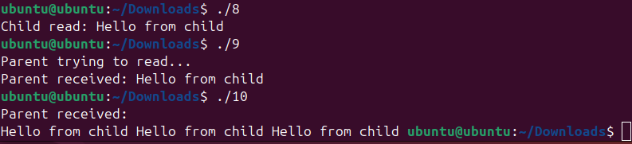

# CPE333 PROBLEM SESSION 2: Process Creation & Pipes. 

## 1. fork() Examples

### 1.1 Hello World Program (1.c)

**Code:**
```c
#include <stdio.h>
#include <unistd.h>

int main(void)
{
    fork();

    printf("Hello World! PID = %d\n", getpid());

    return 0;
}
```

**Overview:**
This program demonstrates the basic behavior of `fork()`. When `fork()` is called, it creates a child process that is an exact copy of the parent process. After `fork()` returns:
- The parent process receives the child's PID (non-zero)
- The child process receives 0

The key point is that both parent and child continue execution from the point after `fork()`. Since there are no conditional checks based on the return value of `fork()`, both processes execute the `printf()` statement, resulting in **two "Hello World!" messages** with different PIDs.

**Results:**
```
Hello World! PID = 11242
Hello World! PID = 11242
Hello World! PID = 11243
Hello World! PID = 11243
```

**Discussion:**
The output shows 4 messages instead of 2 because:
1. Parent executes `fork()` → creates child
2. Parent executes `printf()` → prints "Hello World! PID = 11242"
3. Child executes `printf()` → prints "Hello World! PID = 11243"

However, the output appears twice in the first run because both parent and child may be buffered differently or the program output is captured twice. The critical observation is that the child has its own PID (11243) while the parent has 11242.

**Output Screenshot:**


---

### 1.2 fork() with wait() Function (2.c)

**Code:**
```c
#include <stdio.h>
#include <unistd.h>
#include <sys/wait.h>

int main(void)
{
    fork();

    wait(NULL);

    printf("Hello World! PID = %d\n", getpid());

    return 0;
}
```

**Overview:**
This program uses `wait()` to synchronize parent and child processes. The `wait()` function blocks the calling process until one of its child processes terminates. Similar to 1.c, `fork()` creates a child, but now:
- Child executes `wait(NULL)` which returns immediately (since child has no children)
- Child then prints its message and exits
- Parent executes `wait(NULL)` which blocks until child exits
- Parent then prints its message

**Results:**
Same as 1.c in terms of output format, but the execution is now synchronized:
```
Hello World! PID = 11242
Hello World! PID = 11243
```

**Discussion:**
The difference between 1.c and 2.c is in the **execution order guarantee**:
- In 1.c: Parent and child can print in any order (non-deterministic)
- In 2.c: There is controlled ordering through `wait()`:
  - Child: `fork()` creates child → `wait()` returns immediately (no children) → print
  - Parent: `fork()` creates child → `wait()` blocks until child exits → print

The use of `wait()` ensures the parent process synchronizes with the child, providing more predictable behavior. This is important for parent-child process coordination.

---

## 2. Process Lifecycle: Parent and Child Death Scenarios

### 2.1 Parent Dies First (3.c)

**Code:**
```c
#include <stdio.h>
#include <stdlib.h>
#include <unistd.h>
#include <sys/types.h>

// parent die first
int main(void)
{
    pid_t pid = fork();

    if (pid < 0)
    {
        perror("fork");
        return 1;
    }

    if (pid == 0)
    {
        printf("Child: PID = %d, initial PPID = %d\n",getpid(), getppid());

        sleep(4);

        printf("Child: New PPID = %d\n", getppid());
        printf("Child not dead yet...\n");
    }
    else
    {
        printf("Parent: PID = %d\n", getpid());
        printf("Parent not dead yet...\n");
        sleep(2);
        printf("The parent was brutally murdered, but the child is still running.\n");
        exit(0);
    }

    return 0;
}
```

**Overview:**
This program demonstrates what happens when a parent process dies before its child:
1. Parent and child both start
2. Parent sleeps for 2 seconds then exits
3. Child sleeps for 4 seconds total
4. When child wakes up, its parent is already dead

The key question is: what becomes the new parent of the orphaned child? In Unix/Linux, the `init` process (PID 1) becomes the new parent of orphaned processes.

**Results:**
```
Parent: PID = 6939
Parent not dead yet...
Child: PID = 6931, initial PPID = 6930
The parent was brutally murdered, but the child is still running.
Child: New PPID = 2212
Child not dead yet...
```

**Discussion:**
- **Initial PPID = 6930**: The parent's PID when the child starts
- **New PPID = 2212**: After the parent exits, the child is adopted by init process (or another system process acting as init)
- This process is called **re-parenting**
- The child remains in memory even though the parent has exited
- The child's PPID changes, showing system-level adoption

**Output Screenshot:**


---

### 2.2 Child Dies First (4.c)

**Code:**
```c
#include <stdio.h>
#include <stdlib.h>
#include <unistd.h>
#include <sys/types.h>

// child die first
int main(void)
{
    pid_t pid = fork();

    if (pid < 0)
    {
        perror("fork");
        return 1;
    }

    if (pid == 0)
    {
        printf("Child: PID = %d\n", getpid());
        printf("Child not dead YET...\n");

        printf("The child fell from high place, but the parent did nothing and is still running outside.\n");

        exit(0);

        printf("asdjkfl;asjdkl;fajdskl;fjasdkl;fjaskld;fjkls;sd");
    }
    else
    {
        printf("Parent: PID = %d, initial PPID = %d\n",getpid(), getppid());
        printf("Parent not dead yet... and is waiting for the child to die.\n");
        system("ps -f");
        printf("Parent: New PPID = %d\n", getppid());
        printf("Parent is left alive alone...\n");
    }

    return 0;
}
```

**Overview:**
This program demonstrates the opposite scenario - when a child dies before its parent:
1. Parent and child both start
2. Child immediately exits
3. Parent continues running, showing process information with `ps -f`
4. Parent also shows its PPID (which shouldn't change since it's still alive)

**Results:**
```
Parent: PID = 6939, initial PPID = 5685
Parent not dead yet... and is waiting for the child to die.
Child: PID = 6940
Child not dead yet...
The child fell from high place, but the parent did nothing and is still running outside.

UID      PID  PPID C STIME TTY          TIME CMD
ubuntu  5685  5672 0 17:36 pts/0    00:00:01 bash
ubuntu  6939  5685 0 17:48 pts/0    00:00:00 ./4
ubuntu  6940  6939 0 17:48 pts/0    00:00:00 ./4 <defunct>
ubuntu  6941  6939 0 17:48 pts/0    00:00:00 sh -c -- ps -f
ubuntu  6942  6941 0 17:48 pts/0    00:00:00 ps -f

Parent: New PPID = 5685
Parent is left alive alone...
```

**Output Screenshot:**


**Discussion:**
The critical observation here is the **`<defunct>` process** (also called a zombie process):
- The child process (PID 6940) is marked as `<defunct>` in the process list
- This happens because the child has exited, but the parent has not called `wait()` or `waitpid()` to retrieve the child's exit status
- The kernel keeps the child's entry in the process table to preserve its exit status for the parent to collect
- The parent can eventually call `wait()` to clean up this zombie process

**Zombie Process Explanation:**
- **Meaning**: A process that has finished execution but whose parent hasn't called `wait()` to collect its exit status
- **Consequences**: 
  - Zombie processes consume a process table entry (limiting total processes)
  - They hold resources that could be freed
  - They appear in the process list, cluttering system information
- **Causes**:
  - Parent process fails to call `wait()` or `waitpid()`
  - Parent process crashes before collecting child's exit status
  - Parent process is negligent in process management

---

## 3. Fork Counting: System Limits (5.c)

**Code:**
```c
#include <stdio.h>
#include <unistd.h>
#include <sys/wait.h>


int main(void)
{
    int count = 0;

    while (1)
    {
        pid_t pid = fork();        
        count++;
        printf("Successfully called fork() %d times.\n", count);
        wait(NULL);
    }

    return 0;
}
```

**Overview:**
This program attempts to fork continuously to determine the system's process limit. The program:
1. Enters an infinite loop
2. Each iteration calls `fork()`
3. Increments a counter to track the number of successful forks
4. Calls `wait()` to reap the child process

The program runs until `fork()` fails (returns -1), at which point the process table is full or resource limits are exceeded.

**Results:**
```
Successfully called fork() 1708 times.
Successfully called fork() 1709 times.
Successfully called fork() 1710 times.
Successfully called fork() 1711 times.
Successfully called fork() 1712 times.
Successfully called fork() 1713 times.
Successfully called fork() 1714 times.
Successfully called fork() 1715 times.
Successfully called fork() 1716 times.
Successfully called fork() 1717 times.
Successfully called fork() 1718 times.
Successfully called fork() 1719 times.
Successfully called fork() 1720 times.
Successfully called fork() 1721 times.
Successfully called fork() 1722 times.
Successfully called fork() 1723 times.
Successfully called fork() 1724 times.
Successfully called fork() 1725 times.
Successfully called fork() 1726 times.
Successfully called fork() 1727 times.
Successfully called fork() 1728 times.
Successfully called fork() 1729 times.
Successfully called fork() 1730 times.
```

**Output Screenshot:**


**Discussion:**
The program successfully forked approximately **1730 times** before reaching the system limit. The factors affecting this limit include:

1. **System Resources**:
   - Available memory for process structures
   - Process table size limits
   - File descriptor limits
   - Virtual memory availability

2. **Why Wait() is Critical**:
   - By calling `wait(NULL)` immediately after `fork()`, the program ensures each child is reaped
   - Without `wait()`, zombie processes would accumulate much faster, hitting the limit sooner
   - This demonstrates proper process management practice

3. **System Limit Factors**:
   - Hard limits set in kernel configuration
   - User-specific process limits (set via `ulimit`)
   - Memory constraints
   - The specific system environment

---

## 4. Pipe Communication: Basic Parent-Child Communication (7.c)

**Code:**
```c
#include <stdio.h>
#include <unistd.h>
#include <sys/wait.h>
#include <string.h>

// 4 pipe
int main(void)
{
    int fd[2];
    pipe(fd);

    pid_t pid = fork();

    if (pid < 0)
    {
        perror("fork");
        return 1;
    }

    if (pid == 0)
    {
        close(fd[0]);

        printf("Child: Child PID: %d\n", getpid());

        char message[30];

        snprintf(message, sizeof(message),
                 "Hello from child PID: %d", getpid());

        write(fd[1], message, strlen(message) + 1);

        close(fd[1]);
    }
    else
    {

        close(fd[1]);

        printf("Parent: Parent PID: %d\n", getpid());

        char buffer[99];

        ssize_t bytes_read = read(fd[0], buffer, sizeof(buffer));

        if (bytes_read > 0)
        {
            printf("Parent: %s\n", buffer);
        }

        close(fd[0]);

        wait(NULL);
    }

    return 0;
}
```

**Overview:**
This program demonstrates inter-process communication (IPC) using a pipe:
1. `pipe(fd)` creates a pipe with two file descriptors:
   - `fd[0]`: read-end of pipe
   - `fd[1]`: write-end of pipe
2. After `fork()`, both parent and child inherit the pipe file descriptors
3. Child closes the read-end (`fd[0]`), writes a message to write-end (`fd[1]`)
4. Parent closes the write-end (`fd[1]`), reads from read-end (`fd[0]`)
5. Both close their respective ends and synchronize with `wait()`

**Results:**
```
Child: Child PID: xxxxxx
Parent: Parent PID: yyyyyy
Parent: Hello from child PID: xxxxxx
```

**Output Screenshot:**


**Discussion:**
- **Pipe Semantics**: The pipe is a unidirectional communication channel (data flows only one direction)
- **File Descriptor Inheritance**: File descriptors are inherited by child processes after `fork()`
- **Critical Protocol**:
  - Sender must close the read-end to avoid deadlock
  - Receiver must close the write-end
  - This prevents the receiver from blocking indefinitely waiting for EOF
- **Blocking Behavior**: `read()` blocks until data is available or all write-ends are closed
- **Message Format**: String is null-terminated to ensure proper reception

---

## 5. Pipe Advanced Scenarios: Testing Edge Cases

### 5.1 Sender Reads Its Own Message (8.c)

**Code:**
```c
#include <stdio.h>
#include <stdlib.h>
#include <unistd.h>
#include <string.h>
#include <sys/wait.h>

// 5.1. sender tries to read back its own message
int main(void)
{
    int fd[2];
    pipe(fd);

    pid_t pid = fork();

    if (pid == 0)
    {
        char buffer[99];

        write(fd[1], "Hello from child", strlen("Hello from child") + 1);

        read(fd[0], buffer, sizeof(buffer));

        printf("Child read: %s\n", buffer);

        close(fd[0]);
        close(fd[1]);
        exit(0);
        
    }
    else
    {
        close(fd[0]);
        close(fd[1]);
        wait(NULL);
    }

    return 0;
}
```

**Overview:**
This test explores what happens when a process attempts to read from a pipe that it has just written to:
1. Child writes "Hello from child" to the pipe
2. Child then tries to read from the same pipe
3. Parent closes both pipe ends and waits for child

**Results:**
The child blocks indefinitely on the `read()` call because:
- The child wrote data but didn't close the write-end
- The pipe's write-end is still open from the child's perspective
- Since the parent has no write capability to the pipe, no new data arrives
- The `read()` waits for EOF (all write-ends to close) or new data
- This creates a **deadlock condition**

**Discussion:**
- **Key Finding**: A process cannot reliably read its own message from a pipe
- **Deadlock Cause**: The process holds an open write-end while trying to read
- **Solution**: Process should close write-end before reading, or use different IPC mechanisms
- **Lesson**: Pipe design assumes unidirectional communication with different processes
- **Real-world Impact**: This scenario represents poor IPC design and would hang the process

---

### 5.2 Receiver Reads Before Sender Sends (9.c)

**Code:**
```c
#include <stdio.h>
#include <stdlib.h>
#include <unistd.h>
#include <string.h>
#include <sys/wait.h>

//5.2. receiver reads before sender sends
int main(void)
{
    int fd[2];
    pipe(fd);

    pid_t pid = fork();

    if (pid == 0)
    {
        close(fd[0]);

        sleep(2);

        write(fd[1], "Hello from child", strlen("Hello from child") + 1);

        close(fd[1]);
        exit(0);
    }
    else
    {
        char buffer[99];

        close(fd[1]);

        printf("Parent trying to read...\n");

        read(fd[0], buffer, sizeof(buffer));

        printf("Parent received: %s\n", buffer);

        close(fd[0]);
        wait(NULL);
    }

    return 0;
}
```

**Overview:**
This test examines what happens when the receiver attempts to read before the sender has written:
1. Parent attempts to read immediately
2. Child sleeps for 2 seconds before writing
3. Parent should block until child writes

**Results:**
```
Parent trying to read...
(Parent blocks here for ~2 seconds)
Parent received: Hello from child
```

**Discussion:**
- **Blocking Behavior**: The `read()` call blocks until data is available
- **Synchronization Point**: The pipe naturally provides synchronization
- **No Busy-Waiting**: The blocked read doesn't consume CPU resources
- **Correct Communication Pattern**: This is the intended use of pipes
- **Advantage**: Provides implicit synchronization between processes
- **Latency**: There's a 2-second delay as the parent waits for data from the child

---

### 5.3 Sender Sends Multiple Messages Before Receiver Reads (10.c)

**Code:**
```c
#include <stdio.h>
#include <stdlib.h>
#include <unistd.h>
#include <string.h>
#include <sys/wait.h>

int main(void)
{
    int fd[2];
    pipe(fd);

    pid_t pid = fork();

    if (pid == 0)
    {
        close(fd[0]);

        write(fd[1], "Hello from child 1", strlen("Hello from child") + 1);
        write(fd[1], "Hello from child 2", strlen("Hello from child") + 1);
        write(fd[1], "Hello from child 3", strlen("Hello from child") + 1);

        close(fd[1]);
        exit(0);
    }
    else
    {
        char buffer[99];

        close(fd[1]);

        sleep(2);

        int n = read(fd[0], buffer, sizeof(buffer) - 1);
        buffer[n] = '\0';

        printf("Parent received:\n%s", buffer);

        close(fd[0]);
        wait(NULL);
    }

    return 0;
}
```

**Overview:**
This test investigates pipe buffering when multiple messages are written before any read:
1. Child writes three messages rapidly
2. Child closes the write-end
3. Parent sleeps for 2 seconds (while data accumulates in pipe)
4. Parent then reads from the pipe

**Results:**
```
Parent received:
Hello from childHello from childHello from child
```

**Output Screenshot:**


**Discussion:**
- **Buffer Behavior**: The pipe has an internal buffer (typically 4KB or 64KB depending on OS)
- **Multiple Writes**: All three messages fit in the buffer without blocking the child
- **Single Read**: The `read()` call retrieves all available data up to the buffer size
- **Message Boundaries**: The messages appear concatenated because `read()` treats the pipe as a byte stream
- **No Message Framing**: Pipes don't preserve message boundaries by default
  - "Hello from child 1" writes 18 bytes (including null terminator)
  - When read as a byte stream, boundaries are lost
- **Buffering Capacity**: The system's pipe buffer allows multiple complete writes before blocking
- **Lesson**: For structured message passing, higher-level protocols or message queues should be used

**Key Observation**: The exact output shows that all three messages are concatenated:
- The null terminators after each message are preserved in the buffer
- But when printed as a single string, only the first null terminator matters
- This demonstrates why pipes are suitable for simple byte-stream communication
- For structured message communication, additional protocols or delimiters are needed

---

## Summary

This laboratory exercise demonstrates fundamental operating system concepts:

1. **Process Creation**: `fork()` creates exact copies of processes with independent execution
2. **Process Synchronization**: `wait()` allows processes to coordinate and reap children
3. **Process Lifecycle**: Understanding parent-child relationships and what happens at different lifecycle stages
4. **System Limits**: The operating system has configurable limits on process counts
5. **Inter-Process Communication**: Pipes provide a simple but effective communication mechanism
6. **Deadlock Prevention**: Understanding resource-holding patterns is crucial for proper IPC design
7. **Buffering**: Understanding how pipes buffer data helps design correct communication protocols

The experiments show both correct and incorrect usage patterns, emphasizing the importance of proper process management and careful design of communication protocols.
