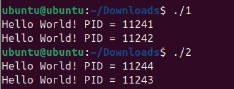
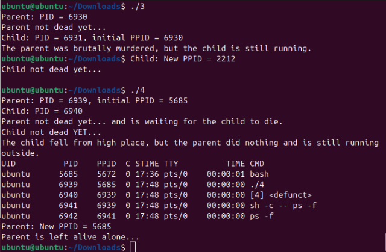
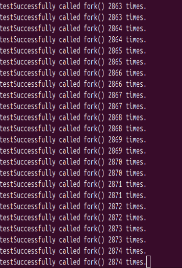
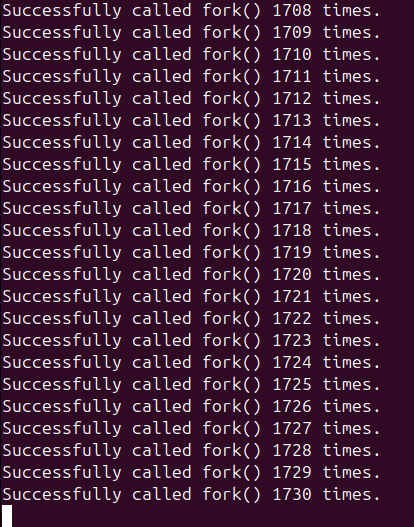
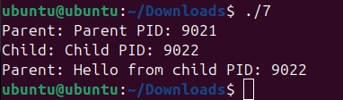
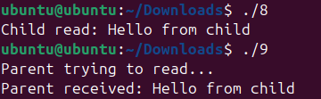
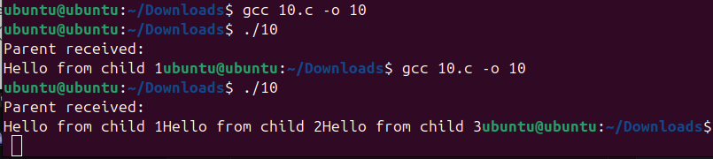

# CPE333 PROBLEM SESSION 2: Process Creation & Pipes. 

## 1. Fork

### 1.1 Hello World Program `1.c`

#### Code
```c
#include <stdio.h>
#include <unistd.h>

int main(void)
{
    fork();

    printf("Hello World! PID = %d\n", getpid());

    return 0;
}
```

#### Results
```bash
Hello World! PID = 11241
Hello World! PID = 11242
```

#### Discussion
The `fork()` is called, so two processes are created and we get two "Hello World" outputs. The first process is the parent and the second is the child. The parent already exists before, so it was assigned PID 11241, while the child was assigned PID 11242.


### 1.2 Fork with wait() `2.c`

#### Code
```c
#include <stdio.h>
#include <unistd.h>
#include <sys/wait.h>

int main(void)
{
    fork();

    wait(NULL);

    printf("Hello World! PID = %d\n", getpid());

    return 0;
}
```

#### Results
```bash
Hello World! PID = 11244
Hello World! PID = 11243
```

#### Discussion
After adding `wait()`, the parent waits for the child to finish. Therefore, the child prints its PID first, and the parent prints its PID afterward. Making the first PID 11244 from the child and 11243 from the parent.

### Output Screenshot


---

## 2. Fork Scenarios

### 2.1 Parent Dies First `3.c`

#### Code
```c
#include <stdio.h>
#include <stdlib.h>
#include <unistd.h>
#include <sys/types.h>

// parent die first
int main(void)
{
    pid_t pid = fork();

    if (pid == 0)
    {
        printf("Child: PID = %d, initial PPID = %d\n",getpid(), getppid());

        sleep(4);

        printf("Child: New PPID = %d\n", getppid());
        printf("Child not dead yet...\n");
        system("ps -f");
    }
    else
    {
        printf("Parent: PID = %d\n", getpid());
        printf("Parent not dead yet...\n");
        sleep(2);
        printf("The parent was brutally murdered, but the child is still running.\n");
        exit(0);
    }
    return 0;
}
```

#### Results
```bash
Child: PID = 9761, initial PPID = 9760
Parent: PID = 9760
Parent not dead yet...
The parent was brutally murdered, but the child is still running.
Child: New PPID = 2212
Child not dead yet...
UID          PID    PPID  C STIME TTY          TIME CMD
ubuntu      5685    5672  0 14:33 pts/0    00:00:01 bash
ubuntu      9761    2212  0 16:17 pts/0    00:00:00 ./3
ubuntu      9762    9761  0 16:17 pts/0    00:00:00 sh -c -- ps -f
ubuntu      9763    9762 99 16:17 pts/0    00:00:00 ps -f
```

#### Discussion
The parent has PID 9760, while the child has PID 9761 and initially has a PPID of 9760, showing that 9760 is its parent. After the parent calls `exit()`, the child continues running even though its parent has terminated. Its PPID then changes from 9760 to 2212, indicating that the child has been adopted by another process.

### 2.2 Child Dies First `4.c`

#### Code
```c
#include <stdio.h>
#include <stdlib.h>
#include <unistd.h>
#include <sys/types.h>
#include <sys/wait.h>

// child die first
int main(void)
{
    pid_t pid = fork();
    wait(NULL);
    if (pid == 0)
    {
        printf("Child: PID = %d\n", getpid());
        printf("Child not dead YET...\n");

        printf("The child fell from high place, but the parent did nothing and is still running outside.\n");
    }
    else
    {
        
        printf("Parent: PID = %d, initial PPID = %d\n",getpid(), getppid());
        printf("Parent not dead yet... and is waiting for the child to die.\n");
        printf("Parent: New PPID = %d\n", getppid());
        printf("Parent is left alive alone...\n");
        system("ps -f");
    }
    return 0;
}
```

#### Results
```bash
Child: PID = 9765
Child not dead YET...
The child fell from high place, but the parent did nothing and is still running outside.
Parent: PID = 9764, initial PPID = 5685
Parent not dead yet... and is waiting for the child to die.
Parent: New PPID = 5685
Parent is left alive alone...
UID          PID    PPID  C STIME TTY          TIME CMD
ubuntu      5685    5672  0 14:33 pts/0    00:00:01 bash
ubuntu      9764    5685  0 16:17 pts/0    00:00:00 ./4
ubuntu      9766    9764  0 16:17 pts/0    00:00:00 sh -c -- ps -f
ubuntu      9767    9766  0 16:17 pts/0    00:00:00 ps -f
```


#### Discussion
The parent has PID 9764, while the child has PID 9765. The child terminates first, while the parent continues running. The parent stays alive, and its PPID remains 5685 because the shell is still running. The `wait()` call causes the parent to wait until the child terminates before continuing.
  
### Output Screenshot


---

## 3. Fork Counting `5.c`

### 3.1 Singular Program
#### Code
```c
#include <stdio.h>
#include <unistd.h>
#include <sys/wait.h>


int main(void)
{
    int count = 0;

    while (1)
    {
        pid_t pid = fork();        
        count++;
        printf("Successfully called fork() %d times.\n", count);
        wait(NULL);
    }

    return 0;
}
```

#### Results
```bash
Successfully called fork() 2874 times.
```

#### Output Screenshot:


### 3.1 Multiple Program
#### Results
```bash
Successfully called fork() 1730 times.
```

### Discussion
The program was able to successfully call fork() 2,874 times when running alone. When multiple copies of the program were running at the same time, it was able to call fork() 1,730 times. The number was lower because multiple programs were using the system's process resources at the same time.

#### Output Screenshot:

---

## 4. Pipe `7.c`

#### Code
```c
#include <stdio.h>
#include <unistd.h>
#include <sys/wait.h>
#include <string.h>

// 4 pipe
int main(void)
{
    int fd[2];
    pipe(fd);

    pid_t pid = fork();
    if (pid == 0)
    {
        close(fd[0]);

        printf("Child: Child PID: %d\n", getpid());

        char message[30];

        snprintf(message, sizeof(message),
                 "Hello from child PID: %d", getpid());

        write(fd[1], message, strlen(message) + 1);

        close(fd[1]);
    }
    else
    {

        close(fd[1]);

        printf("Parent: Parent PID: %d\n", getpid());

        char buffer[99];

        ssize_t bytes_read = read(fd[0], buffer, sizeof(buffer));

        if (bytes_read > 0)
        {
            printf("Parent: %s\n", buffer);
        }

        close(fd[0]);

        wait(NULL);
    }

    return 0;
}
```

#### Results
```bash
Parent: Parent PID: 10372
Child: Child PID: 10373
Parent: Hello from child PID: 10373
```
#### Discussion
The child `write()` a message containing its PID into the pipe, while the parent `read()` and displays the message. The parent `read()` and displays the child's PID, which is 10373.

#### Output Screenshot



---

## 5. Pipe Scenarios

### 5.1 Sender Reads Its Own Message `8.c`

#### Code
```c
#include <stdio.h>
#include <stdlib.h>
#include <unistd.h>
#include <string.h>
#include <sys/wait.h>

// 5.1. sender tries to read back its own message
int main(void)
{
    int fd[2];
    pipe(fd);

    pid_t pid = fork();

    if (pid == 0)
    {
        char buffer[99];

        write(fd[1], "Hello from child", strlen("Hello from child") + 1);

        read(fd[0], buffer, sizeof(buffer));

        printf("Child read: %s\n", buffer);

        close(fd[0]);
        close(fd[1]);
        exit(0);
        
    }
    else
    {
        close(fd[0]);
        close(fd[1]);
        wait(NULL);
    }

    return 0;
}
```

#### Results
```bash
Child read: Hello from child
```

#### Discussion
The child `write()` a message into the pipe and then `read()` from the same pipe. Since the message is stored in the pipe, the child is able to `read()` back its own message, displaying "Hello from child".

### 5.2 Receiver Reads Before Sender `9.c`

#### Code
```c
#include <stdio.h>
#include <stdlib.h>
#include <unistd.h>
#include <string.h>
#include <sys/wait.h>

//5.2. receiver reads before sender sends
int main(void)
{
    int fd[2];
    pipe(fd);

    pid_t pid = fork();

    if (pid == 0)
    {
        close(fd[0]);

        sleep(2);

        write(fd[1], "Hello from child", strlen("Hello from child") + 1);

        close(fd[1]);
        exit(0);
    }
    else
    {
        char buffer[99];

        close(fd[1]);

        printf("Parent trying to read...\n");

        read(fd[0], buffer, sizeof(buffer));

        printf("Parent received: %s\n", buffer);

        close(fd[0]);
        wait(NULL);
    }

    return 0;
}
```

#### Results
```bash
Parent trying to read...
Parent received: Hello from child
```

#### Discussion
The parent tries to `read()` from the pipe before the child sends its message. Since the pipe is empty, the `read()` function waits until the child writes data into the pipe. After 2 seconds, the child sends the message, and the parent receives and displays it.

### Output Screenshot


### 5.3 Sender Sends 3 Messages Before Receiver Reads `10.c`

#### Code
```c
#include <stdio.h>
#include <stdlib.h>
#include <unistd.h>
#include <string.h>
#include <sys/wait.h>

int main(void)
{
    int fd[2];
    pipe(fd);

    pid_t pid = fork();

    if (pid == 0)
    {
        close(fd[0]);

        write(fd[1], "Hello from child 1", strlen("Hello from child 1") + 1);
        write(fd[1], "Hello from child 2", strlen("Hello from child 2") + 1);
        write(fd[1], "Hello from child 3", strlen("Hello from child 3") + 1);

        close(fd[1]);
        exit(0);
    }
    else
    {
        char buffer[99];

        close(fd[1]);

        sleep(2);

        int n = read(fd[0], buffer, sizeof(buffer) - 1);
        buffer[n] = '\0';

        printf("Parent received:\n%s", buffer);

        close(fd[0]);
        wait(NULL);
    }

    return 0;
}
```

#### Results
##### The code above
```bash
Parent received:
Hello from child 1
```
##### Remove the `+ 1` after teh `strlen()`
```bash
Parent received:
Hello from child 1Hello from child 2Hello from child 3
```
#### Discussion
The child sends three separate messages into the pipe before the parent `read()` them. The messages are stored in the pipe until the parent calls read(). With + 1 included in each `write()`, each message contains a null terminator (\0), so the parent only displays the first message.

When `+ 1` is removed, no null terminator is included between the messages, so the parent displays all three messages together.

### Output Screenshot

